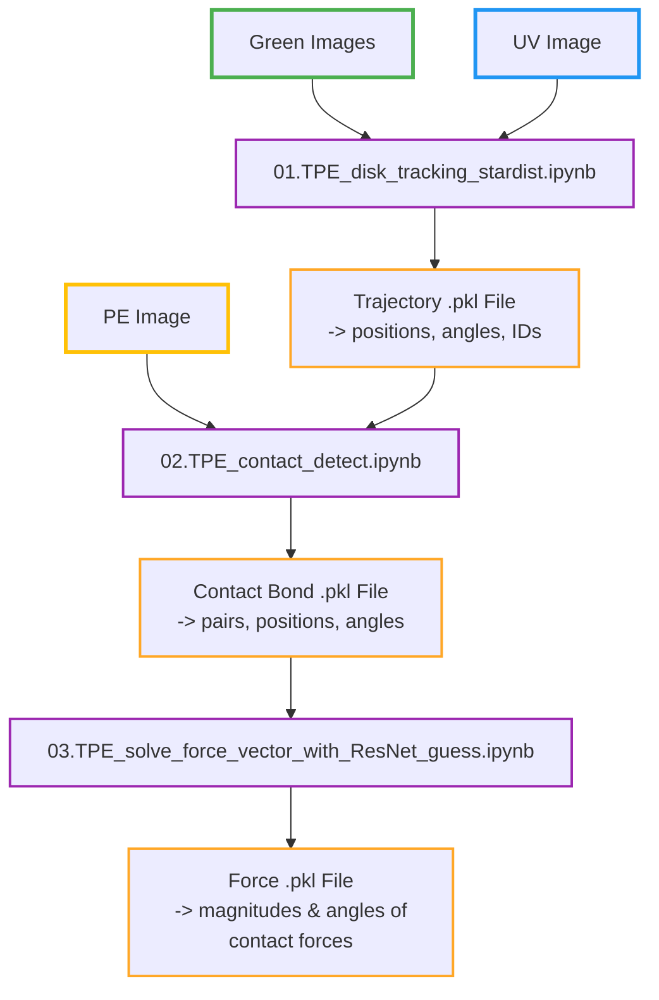

# TPE Disk Image Processing

This repository contains a three-step image analysis pipeline for tracking photoelastic disks, detecting contacts, and computing force vectors in granular material experiments.

## Workflow Overview

The analysis pipeline consists of three sequential notebooks that process experimental images to extract particle trajectories and force networks:



## Pipeline Steps

### Step 1: Disk Tracking with StarDist
**Notebook:** `01.TPE_disk_tracking_stardist.ipynb`

This notebook performs automated detection and tracking of photoelastic disks throughout the experiment.

**Key Features:**
- Disk detection using pre-trained StarDist2D model
- Particle linking into trajectories using Trackpy
- Rotation angle computation via PCA on disk orientation markers
- Boundary particle identification

**Inputs:**
- Raw experimental images
- StarDist model for disk segmentation

**Outputs:**
- Pickle file containing:
  - Particle positions (x, y) for each frame in pixels
  - Particle IDs and trajectories
  - Disk radii (rpx) in pixels
  - Angular positions (theta)
  - Boundary particle tags

### Step 2: Contact Detection
**Notebook:** `02. TPE_contact_detect.ipynb`

Identifies and classifies contacts between particles using a trained CNN model.

**Key Features:**
- Neighbor detection based on distance threshold
- Contact classification using neural network

**Inputs:**
- Trajectory pickle file from Step 1
- PE images
- Pre-trained contact detection model

**Outputs:**
- Contact dataframe with:
  - Contact pairs (i, j)
  - Contact positions (xi, yi, xj, yj)
  - Contact angles (beta)
  - Classification scores

### Step 3: Force Vector Computation
**Notebook:** `03. TPE_solve_force_vector_with_ResNet_guess.ipynb`

Computes force magnitudes and directions at each contact using photoelastic image analysis and optimization.

**Key Features:**
- Initial force guess using ResNet regression model
- Force optimization with equilibrium constraints (∑F=0, ∑τ=0)

**Inputs:**
- Contact data from Step 2
- Photoelastic images
- Pre-trained force prediction model

**Outputs:**
- Force vectors (magnitude and angle) at each contact
- Total force on each particle

## Setup

### Requirements

This pipeline uses a single conda environment **`torch_env`** for all notebooks.

### Installation

**Quick start:**
```bash
cd environments/
conda env create -f torch_env.yml
```

**Note:** Select the `torch_env` kernel when running any notebook.

## Usage Outline

1. **Update experiment parameters** in each notebook:
   - `IMG_DIR`: Directory containing experimental images
   - `EXP_FOLDER`: Experiment folder name

2. Follow the instructions in each notebook to run the analysis steps sequentially

3. **Output files** are saved as pickle files in the specified output directory

## File Structure

```
TPE_image_process_pipeline/
├── 01. TPE_disk_tracking_stardist.ipynb    # Disk detection & tracking
├── 02. TPE_contact_detect.ipynb            # Contact detection
├── 03. TPE_solve_force_vector_with_ResNet_guess.ipynb  # Force computation
├── environments/
│   └── torch_env.yml                       # Single unified conda environment
├── README.md                                # This file
└── .gitignore                               # Git ignore rules
```

